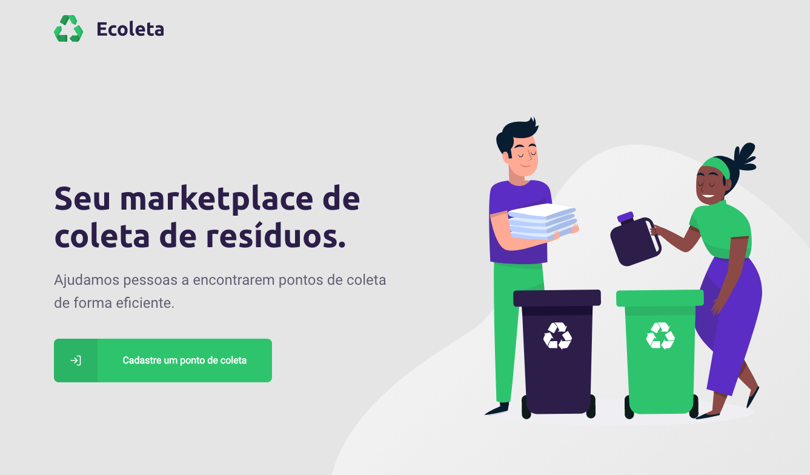
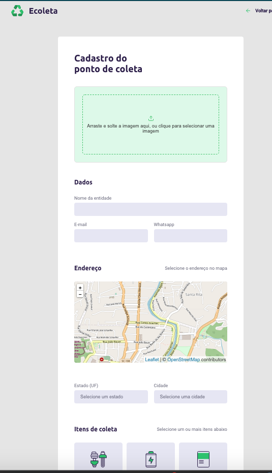
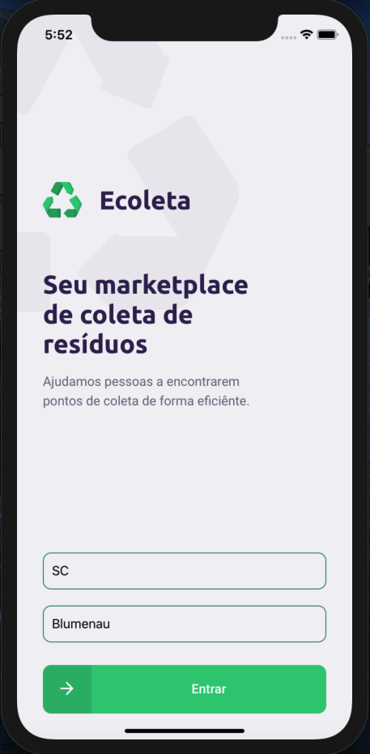
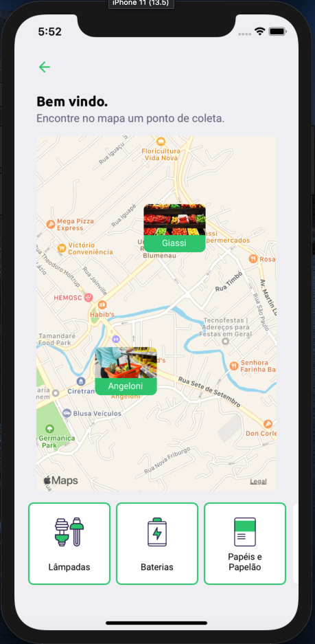

# Ecoleta

Projeto utilizando uma stack diferente do NextLevelWeek [original](https://github.com/marvinwagner/nlw)
utilizando Vue.js para web






## Servidor

```
cd server
npm run dev
```
Criar um arquivo .env na pasta "server" com a chave API_URL=http://192.168.XX.X:3333 informando seu endereço de rede

## Web
```
cd web
yarn serve
```
